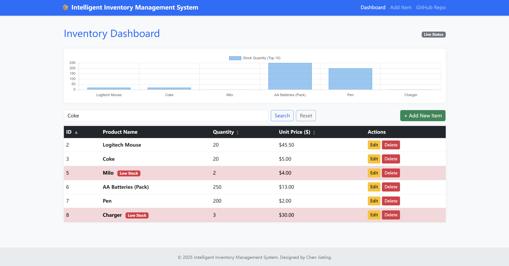

# Inventory Management System

A web-based inventory tracking application built with Python (Flask) and SQLAlchemy. Designed to replace manual spreadsheet management with a centralized, SQL-backed solution.

**Live Demo:** [https://jiating-inventory-system.onrender.com/](https://jiating-inventory-system.onrender.com/)

---

## Project Context
This project was developed to address data consistency issues often found in manual inventory tracking (e.g., Excel). It provides a structured database schema, real-time data validation, and a centralized dashboard for team accessibility.

## Key Features

* **Dashboard & Visualization**: Overview of current stock assets with Chart.js integration.
* **Search & Filtering**: Server-side filtering allowing quick lookup by product name.
* **Sorting**: Dynamic sorting by Quantity and Unit Price (Ascending/Descending).
* **Inventory Alerts**: Automatic visual highlighting for items with low stock (< 20 units).
* **CRUD Operations**: Full Create, Read, Update, and Delete capabilities with SQL persistence.

## Tech Stack

* **Backend**: Python 3.11, Flask
* **Database**: SQLite (Local Dev), SQLAlchemy ORM
* **Frontend**: Bootstrap 5, Jinja2, Chart.js
* **Deployment**: Render, Gunicorn

## Screenshots



## Local Setup

To run this application locally, follow these steps:

1.  **Clone the repository**
    ```bash
    git clone [https://github.com/Tinking32/inventory-system.git](https://github.com/Tinking32/inventory-system.git)
    cd inventory-system
    ```

2.  **Create and activate a virtual environment**
    ```bash
    # Windows
    python -m venv venv
    venv\Scripts\activate

    # Mac/Linux
    python3 -m venv venv
    source venv/bin/activate
    ```

3.  **Install dependencies**
    ```bash
    pip install -r requirements.txt
    ```

4.  **Run the application**
    ```bash
    python app.py
    ```
    Access the app at `http://127.0.0.1:5000`.

## Contact

**Chen Jiating**
* **Email**: kungchenisblack@gmail.com
* **GitHub**: [Tinking32](https://github.com/Tinking32)